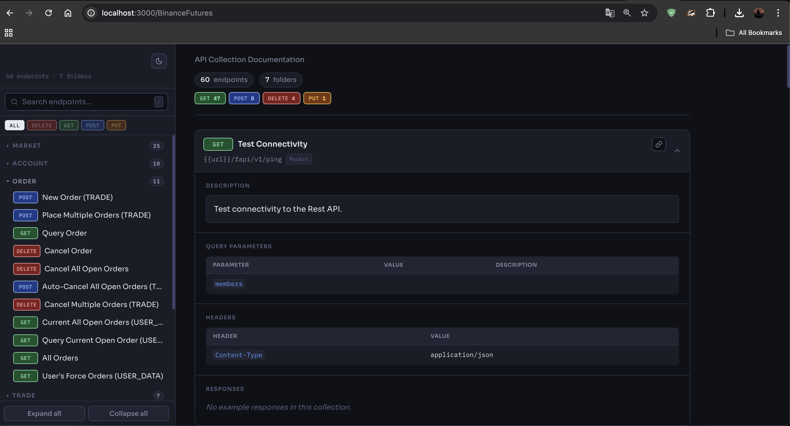
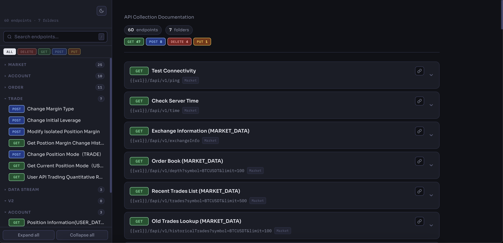
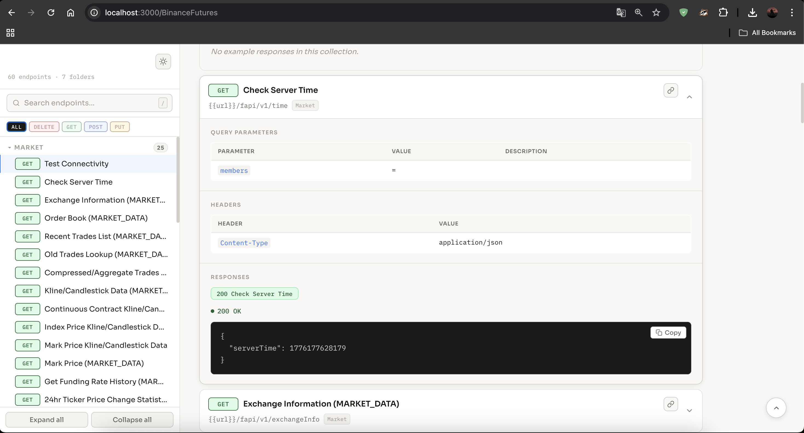

# API Doc Server

A lightweight Node.js application that serves API documentation in a clean and structured format using pre-exported collections.

---

## Supported Collection Formats

Postman

## Overview

This project allows you to host and display your API collections (such as Postman exports) as readable API documentation.

### Workflow

1. Export your API collection.
2. Place it inside the `collection_exports` folder.
3. Configure the collection name and file path in `config.js`.
4. Run the server and access your API docs in a browser.

---

## Project Structure

```
api_doc_server/
│
├── collection_exports/     # Store exported API collections
├── config.js               # Collection and Path name configuration
├── app.js                  # Server entry point
├── routes/                 # Route definitions
├── controllers/            # Documentation logic
└── package.json
```

---

## Configuration

All configuration is handled inside `config.js`.

Example:

```js
module.exports = {
  collectionName: "My API",
  collectionPath: "./collection_exports/my_api_collection.json"
};
```

### Parameters

* `collectionName`: Display name of your API documentation
* `collectionPath`: Path to the exported collection file

---

## Adding a Collection

1. Export your API collection (e.g., from Postman)
2. Move the exported `.json` file into:

```
collection_exports/
```

3. Update `config.js` accordingly

---

## Running the Server

Install dependencies:

```bash
npm install
```

Start the server:

```bash
node app.js
```
---

## Screenshots

Add your screenshots below to showcase the UI and features of the project.

### Filter Request Methods


### Folder structure


### Response view


---

## How It Works

* The server reads the collection file defined in `config.js`
* It parses the collection structure
* It renders dynamically endpoints in a readable API documentation format
* Changes require a server restart to take effect

---

## Features

* Simple setup
* No need restart the app for updating document just update the export
* Config-driven collection loading
* Clean API documentation rendering

---

## Notes

* Ensure the collection JSON file is valid
* If you a are updating config.js restart is required. (You can update collection without restart)

---

## License

MIT License

---

## Author

denizyts